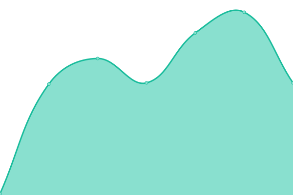

# [📈 Live Status](https://status.rcw.pt): <!--live status--> **🟩 All systems operational**

This repository contains the open-source uptime monitor and status page for [rickyunic](https://status.rcw.pt), powered by [Upptime](https://github.com/upptime/upptime).

With [Upptime](https://upptime.js.org), you can get your own unlimited and free uptime monitor and status page, powered entirely by a GitHub repository. We use [Issues](https://github.com/rickyunic/uptime/issues) as incident reports, [Actions](https://github.com/rickyunic/uptime/actions) as uptime monitors, and [Pages](https://status.rcw.pt) for the status page.

<!--start: status pages-->
<!-- This summary is generated by Upptime (https://github.com/upptime/upptime) -->
<!-- Do not edit this manually, your changes will be overwritten -->
<!-- prettier-ignore -->
| URL | Status | History | Response Time | Uptime |
| --- | ------ | ------- | ------------- | ------ |
|  [VIVEIROS.EU](https://viveiros.eu) | 🟩 Up | [viveiros-eu.yml](https://github.com/rickyunic/uptime/commits/HEAD/history/viveiros-eu.yml) | 

 3175ms
     
 | 

<a href="https://status.rcw.pt/history/viveiros-eu">99.62%</a>
    

|  [RICKYUNIC.COM](https://rickyunic.com) | 🟩 Up | [rickyunic-com.yml](https://github.com/rickyunic/uptime/commits/HEAD/history/rickyunic-com.yml) | 

 1550ms
     
 | 

<a href="https://status.rcw.pt/history/rickyunic-com">100.00%</a>
    

|  [RCW.PT](https://rcw.pt) | 🟩 Up | [rcw-pt.yml](https://github.com/rickyunic/uptime/commits/HEAD/history/rcw-pt.yml) | 

 946ms
     
 | 

<a href="https://status.rcw.pt/history/rcw-pt">100.00%</a>
    

|  [IAFARMA.COM](https://iafarma.com) | 🟩 Up | [iafarma-com.yml](https://github.com/rickyunic/uptime/commits/HEAD/history/iafarma-com.yml) | 

 506ms
     
 | 

<a href="https://status.rcw.pt/history/iafarma-com">100.00%</a>
    

|  [HOST - RCW - SRV EU](89.117.169.110) | 🟩 Up | [host-rcw-srv-eu.yml](https://github.com/rickyunic/uptime/commits/HEAD/history/host-rcw-srv-eu.yml) | 

 115ms
     
 | 

<a href="https://status.rcw.pt/history/host-rcw-srv-eu">55.77%</a>
    

|  [HOST - IAFARMA - GATOR](50.87.144.100) | 🟩 Up | [host-iafarma-gator.yml](https://github.com/rickyunic/uptime/commits/HEAD/history/host-iafarma-gator.yml) | 

 70ms
     
 | 

<a href="https://status.rcw.pt/history/host-iafarma-gator">100.00%</a>
    

|  [HOST - FICC - PTISP](94.46.176.170) | 🟩 Up | [host-ficc-ptisp.yml](https://github.com/rickyunic/uptime/commits/HEAD/history/host-ficc-ptisp.yml) | 

 131ms
     
 | 

<a href="https://status.rcw.pt/history/host-ficc-ptisp">100.00%</a>
    

|  [HOMEPETTING.COM](https://homepetting.com) | 🟩 Up | [homepetting-com.yml](https://github.com/rickyunic/uptime/commits/HEAD/history/homepetting-com.yml) | 

 462ms
     
 | 

<a href="https://status.rcw.pt/history/homepetting-com">100.00%</a>
    

|  [GIRALIVING.COM](https://giraliving.com/) | 🟩 Up | [giraliving-com.yml](https://github.com/rickyunic/uptime/commits/HEAD/history/giraliving-com.yml) | 

 941ms
     
 | 

<a href="https://status.rcw.pt/history/giraliving-com">100.00%</a>
    

|  [FICC.ORG](http://ficc.org) | 🟩 Up | [ficc-org.yml](https://github.com/rickyunic/uptime/commits/HEAD/history/ficc-org.yml) | 

 1983ms
     
 | 

<a href="https://status.rcw.pt/history/ficc-org">99.85%</a>
    

|  [FCMP](https://www.fcmportugal.com/) | 🟩 Up | [fcmp.yml](https://github.com/rickyunic/uptime/commits/HEAD/history/fcmp.yml) | 

 2764ms
     
 | 

<a href="https://status.rcw.pt/history/fcmp">54.33%</a>
    

|  [Clube Campismo Lisboa](https://clubecampismolisboa.pt/) | 🟩 Up | [clube-campismo-lisboa.yml](https://github.com/rickyunic/uptime/commits/HEAD/history/clube-campismo-lisboa.yml) | 

 1806ms
     
 | 

<a href="https://status.rcw.pt/history/clube-campismo-lisboa">54.33%</a>
    

|  [Camping Card International](https://www.campingcardinternational.com/) | 🟩 Up | [camping-card-international.yml](https://github.com/rickyunic/uptime/commits/HEAD/history/camping-card-international.yml) | 

 1204ms
     
 | 

<a href="https://status.rcw.pt/history/camping-card-international">100.00%</a>
    

|  [Hipnose Clínica Rita Fonseca](https://hipnoseclinicarf.com/) | 🟩 Up | [hipnose-clinica-rita-fonseca.yml](https://github.com/rickyunic/uptime/commits/HEAD/history/hipnose-clinica-rita-fonseca.yml) | 

 763ms
     
 | 

<a href="https://status.rcw.pt/history/hipnose-clinica-rita-fonseca">67.30%</a>
    

<!--end: status pages-->

[**Visit our status website →**](https://status.rcw.pt)

## 📄 License

- Powered by: [Upptime](https://github.com/upptime/upptime)
- Code: [MIT](./LICENSE) © [Anand Chowdhary](https://anandchowdhary.com), supported by [Pabio](https://pabio.com)
- Data in the `./history` directory: [Open Database License](https://opendatacommons.org/licenses/odbl/1-0/)
